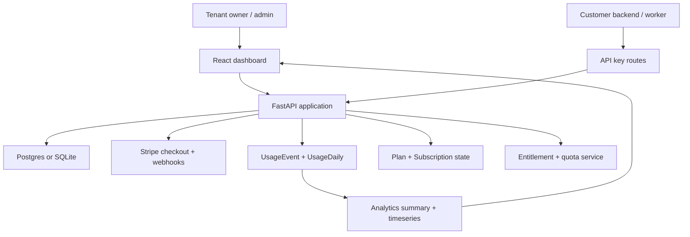

# MeterStack Architecture

MeterStack is a multi-tenant SaaS infrastructure backend with a thin product UI on top. Its purpose is to centralize plan state, entitlement logic, usage metering, and analytics for customer-facing SaaS apps.

## System Shape

## Core Domain

- `Tenant`: organization boundary for all app data
- `User`: tenant-scoped identity with owner/admin/member roles
- `Plan`: commercial plan with interval and price
- `Feature`: named capability used for gating or limits
- `PlanFeature`: plan-to-feature mapping with optional numeric limit
- `Subscription`: current plan state for a tenant
- `UsageEvent`: raw usage write for auditability and rebuilds
- `UsageDaily`: daily aggregate used for analytics and quota math
- `ApiKey`: hashed service credential for backend-to-backend calls
- `ProcessedStripeEvent`: webhook dedupe table for idempotency

## Request Flows

### 1. Auth

`/auth/signup` creates a tenant and owner user.

`/auth/login` returns a JWT with user and tenant claims.

`/me` resolves the current tenant-scoped session.

### 2. Billing

`/billing/plans` lists available plans and marks the tenant’s current one.

`/billing/create-checkout-session` either:

- returns a Stripe checkout URL in `stripe` mode, or
- updates the local subscription immediately in `mock` mode.

`/billing/webhook` consumes Stripe events and uses `ProcessedStripeEvent` to prevent duplicate work.

### 3. Entitlements And Quotas

Entitlements are derived from the active subscription’s plan.

Quota checks:

1. resolve the active subscription
2. find the requested feature in `PlanFeature`
3. compute the current billing period
4. sum `UsageDaily` for that feature
5. compare projected usage against the limit

### 4. Usage Ingestion

Both owner-auth routes and API-key routes record usage through the same flow:

1. validate the feature exists
2. optionally enforce quota
3. write a `UsageEvent`
4. update the matching `UsageDaily` row in the same request

The rebuild job remains available for repair and backfill scenarios.

### 5. Analytics

`/analytics/summary` returns totals per feature for the current billing period.

`/analytics/timeseries` returns day-by-day totals for a single feature.

These endpoints power the dashboard and usage chart views.

## Deployment Model

- Local default: SQLite for a fast zero-infra demo path
- CI / deployed target: Postgres
- Public demo mode: `BILLING_MODE=mock`
- Local Stripe work: `BILLING_MODE=stripe` with test keys and webhook secret

## Operational Choices

- Dev-only operational helpers are gated behind `ENABLE_DEV_ENDPOINTS`
- CORS is explicit through `ALLOWED_ORIGINS`
- API keys are hashed and only revealed once
- Rate limiting is enforced on `/client/*`
- Docker and Render configs stay close to the real deployment story

## Why This Project Reads Well In Interviews

MeterStack shows more than CRUD:

- clear multi-tenant boundaries
- auth plus service-to-service auth
- commercial plan modeling
- entitlement and quota logic
- event ingestion with aggregate maintenance
- webhook idempotency
- deployable product surface, not just APIs
