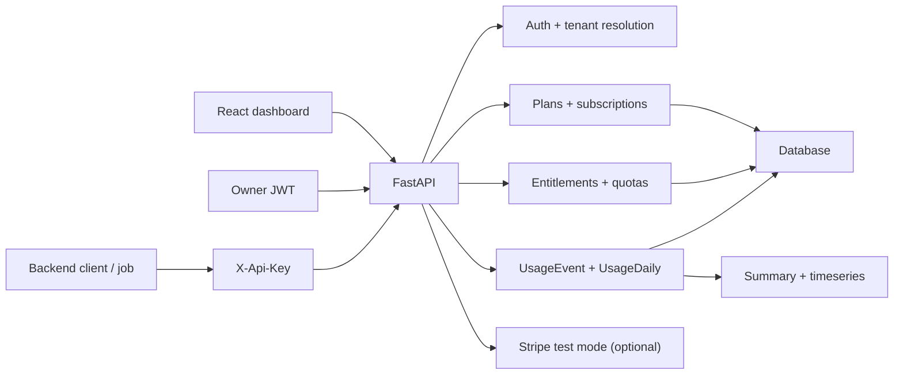

# System Overview

```mermaid
flowchart LR
    UI["React dashboard"] --> API["FastAPI"]
    OWNER["Owner JWT"] --> API
    SERVICE["Backend client / job"] --> KEY["X-Api-Key"]
    KEY --> API
    API --> AUTH["Auth + tenant resolution"]
    API --> BILLING["Plans + subscriptions"]
    API --> ENT["Entitlements + quotas"]
    API --> METER["UsageEvent + UsageDaily"]
    METER --> ANALYTICS["Summary + timeseries"]
    BILLING --> DB["Database"]
    ENT --> DB
    METER --> DB
    API --> STRIPE["Stripe test mode (optional)"]
```
